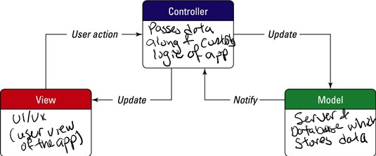

# GreenPeeps/SomethingRandom
> _Note:_ This document is meant to evolve throughout the planning phase of your project.   That is, it makes sense for you commit regularly to this file while working on the project (especially edits/additions/deletions to the _Highlights_ section). Most importantly, it is a reflection of all the planning you work you've done in the first iteration. 
 > **This document will serve as a master plan between your team, your partner and your TA.**

## Product Details
 
#### Q1: What are you planning to build?

We are building a mobile application to track user’s carbon emissions and provide advice on how the user can reduce their carbon emissions in an approachable and visually appealing way.

**Figma Link to wireframes**
https://www.figma.com/file/LlIiMsIG2aaIFGPHEpDuij/Mock-up?node-id=0%3A1

From our partner’s vision of the app:

“Users can fill out a helpful wizard and answer simple questions to get a sense of their carbon emissions from sources like daily commute, power needs at home, diet, hobbies and more. Users can set a goal for lowering their own carbon emissions. Users can see an estimate of their carbon footprint laid out to compare to national and international averages (and compared to other users and their goal). The app monitors and inputs certain emissions automatically (like driving 40km) and can enter others manually (like eating a cheeseburger). Users can 'befriend' other users to see their profiles, activities and progress. Users can make shared emission goals with other users. Users can post their app usage (milestones etc.) to social media. App administrators can push messages to all users (or subscriber subset) with helpful tips for emission reduction.”

“To that end, I'm looking to build an app that can track user behaviours that contribute to carbon emissions. The app will help to set a baseline carbon footprint for the user and work with the user to set a goal and reduce emissions to reach that goal. The app will empower users to achieve more by connecting them socially with peers for both motivational (you can do it too!) and informational (here's how I achieved change) purposes.”

We are planning to build a MVP for a mobile app that works for iOS and Android. The purpose of the app is to track carbon emissions and to see how a user’s carbon emissions compare to others while also offering ways to reduce one’s emissions. Functionalities include the ability to fill out questions about one’s carbon emissions, view your carbon emissions and post progress to social media.

#### Q2: Who are your target users?

The app to will mainly target carbon-conscious people in North America, since it will be in English and will feature key carbon emission habits of middle and upper class North Americans (driving, flying and transit use, power usage, water usage, food wastage).

#### Q3: Why would your users choose your product? What are they using today to solve their problem/need?

Many people want to reduce their carbon footprint in order to help the environment these days; however, these users often struggle to find the time and effective ways to do so. This app will target these users and help them reduce their carbon emission. 

Building a carbon footprint is difficult to do in one sitting, since asking too few questions results in too vague of a footprint, and asking too many becomes quickly tedious. Our app will allow the user to assemble their profile over time, by asking them daily questions. The user will be able to choose how many questions they choose to answer, thus allowing them to build a carbon profile as a part of their daily routine.

Reducing one’s carbon footprint is another challenging process we will streamline. By presenting information and advice on reducing their carbon emissions in small, digestible packets, we save the users time and effort having to research these topics in depth. Furthermore, by presenting the user options for incrementally improving their carbon emissions, this will make the topic approachable and allow the user to form carbon-conscious habits.

Overall, this supports GreenPeeps’ mandate to reduce carbon emissions by encouraging carbon-conscious individuals to make incremental changes to improve their footprint.

#### Q4: How will you build it?

* “Front end”/”Back end”:
  * Flutter Framework & Dart language
GetX framework for Flutter (one of the top 3 frameworks for Flutter currency, shortens boiler plate code)
* Database
  * (possibly) MongoDB (as it scales relatively well and can easily integrate with most PaaS providers)
  * (possibly) PostgreSQL 
  * (possibly) Firebase (as it has an easy setup process)
* PaaS products
  * (possibly) Microsoft Azure (as it’s free on Github student pack)
  * (possibly) Heroku (as it’a free and easy to use)
* Tools
  * VSCode IDE
  * Figma (to wireframe the design and share with everyone)
  * Android Studio (for Android emulation and testing)
  * MacOS emulator (for iOS emulation and testing)
  * Postman (for testing requests)
* Possible third party apps or APIs
  * Google charts API to display carbon emissions in a circle graph
  * (possibly) Google, Facebook, instagram, etc. APIs for “Log in with x”
  * (possibly) mobile analytics APIs (from Amazon or another tool)
  * APIs that allow integration of whatever database we’re using with our app

We will either use Github Actions (for the convenience and integration right on GitHub) or  Jenkins (for the open source aspect, with less pricing limits on deployment). It will depend completely on what our business needs will be and what our partner’s plan is with the app after it’s creation (which is currently undecided).

We will be following Model View Controller (MVC), doing Test Driven Development, and integrating SOLID Design principles into our code.

Our testing strategy consists of testing in several stages of building and testing for various screens of the app. We plan to do Test Driven Development, by writing (or mocking out) tests for calculations, requests and screens, then writing code, then executing the tests and fixing the code accordingly. When appropriate, we will do manual testing through emulators,  physical devices, and third-party testing tools (like Postman). Some examples of tests include:
  * Unit tests with Flutter test package
  * Mock/stubb user profiles and actions for testing of carbon emission visualization
  * Postman to test requests from database to app
  * Manual UI tests both from emulators (for easy debugging and testing of features)
  * Manual UI tests/usage from Android/iOS devices (for testing native things that emulators cannot simulate + testing the app in every day life for a prolonged period of time)

#### Q5: What are the user stories that make up the MVP?

1.  As a new user, I want to create an account, in order to access the app and record my activity. 
Acceptance Criteria: 
Given that I want to create an account, when I enter into the app from my phone, then I have the option to Sign Up by filling in information, Sign Up with Google, or Sign Up with Facebook.

2. As a new user, I want to fill out a survey of my carbon footprint, in order to see visualizations of my carbon emissions
Acceptance Criteria: Given that I want to see my carbon emissions, when I fill out the intruductory questionnaire, then I will see a chart of my carbon emissions. 

3. As a current user, I want to be able to post my progress steps to social media, in order to share my progress with my friends.
Acceptance Criteria: 
Given that I’ve just achieved a big milestone and want to share my progress, when I press the share button, then the app will format a post and let me modify and share it on social media.

4.  As a current user, I want to update my carbon emissions diary entry every day, in order to get an accurate report of my carbon emissions and update my carbon emissions visualizations.
Acceptance Criteria: 
Given that I want to update my carbon emissions diary, when I login to the app, then I should be able to quickly answer the questions tracking my current carbon reduction goals and see my carbon emission visualizations update.

5. As an administrator of the app, I want to use a dashboard to access the backend, in order to manage users/the app content, and data. 
Acceptance Criteria: Given that I want to access or modify some of the app’s data, when I login to a dashboard, then I should be able to visualize and modify the app’s data. Specifically, 
    a. Given that I want to access or modify some of the app’s data, when I login to a dashboard, then I should be able to add a new or change the existing carbon emission questions that are given to users. 
    b. Given that I want to access or modify some of the app’s data, when I login to a dashboard, then I should be able to add a new or change existing goal reccomendations that are given to users. 
    c. Given that I want to access or modify some of the app’s data, when I login to a dashboard, then I should be able to add a new or change existing user accounts. 

----
## Intellectual Property Confidentiality Agreement 

After consulting our partner, we have decided that we will only share the code under an open-source license with the partner but agree to not distribute it in any way to any other entity or individual. 

----

## Process Details

#### Q6: What are the roles & responsibilities on the team?
* Akiki
  * Role: Software Engineer, Technical Project Manager
  * Responsibilities: Team for carbon emissions reduction and social media sharing
  * Technical Strengths: Flutter/Dart, Integration/Unit test writing experience, transferable experience with software development process at startup and big tech
  * Technical Weaknesses: No experience with relational databases, no previous SQL Experience, lack of full stack app development experience
* Eryka
  * Role: Software Engineer, UI/UX Designer
  * Responsibilities: Team for carbon emissions reduction and data collection
  * Technical Strengths: Flutter/Dart, SQL, Expert in development methodologies and clean code
  * Technical Weaknesses: UI testing, lack of full-stack app development, database and API experience
* Grace
  * Role: Software Engineer, UI/UX Designer
  * Responsibilities: Carbon emissions visualization team
  * Technical Strengths:  Figma, SQL, Expert in development methodologies
  * Technical Weaknesses: No direct database/server experience, no testing experience beyond unit tests, experience using APIs
* Hayden
  * Role: Software Engineer, UI/UX Designer
  * Responsibilities: Login and New User Experience team
  * Technical Strengths: Experience with Heroku & PaaS products, SQL, Experience working with large databases
  * Technical Weaknesses: No testing experience beyond unit tests, no Flutter/Dart experience, no mobile development experience
* Jeffrey
  * Role: Software Engineer, UI/UX Designer
  * Responsibilities: Team for tips for reducing carbon emissions reduction
  * Technical Strengths: SQL, Expert in ML/AI, Expert in Testing
  * Technical Weaknesses: No direct database/server experience, no testing experience beyond unit tests, no Flutter/Dart experience
* Nathan
  * Role: Software Engineer, Technical Project Manager
  * Responsibilities: Login and New User Experience team
  * Technical Strengths: Mobile Development, Flutter/Dart, NoSQL databases, backend development
  * Technical Weaknesses: SQL, UI/UX, UI testing
* Philip
  * Role: Software Engineer, Technical Project Manager
  * Responsibilities: Team for tips on reducing carbon emissions
  * Technical Strengths: SQL, backend development, Expert in Testing
  * Technical Weaknesses: Non-relational DBs, Javascript, Go

#### Q7: What operational events will you have as a team?

We plan to have bi-weekly meetings with the team Sundays online from 3-5 pm. They will be more frequent closer to deliverable deadlines.
We will meet Jeffrey Zon (the entrepreneur behind the GreenPeeps idea) Sunday 9-10 pm. 

In team meetings, we will discuss technical updates (what we have done/ what we will be doing- scrum meetings) and confirm the direction/ decisions we have made. This is a chance for sub-teams to fill in others on their progress, and for everyone to ask questions of each other.
There may be other events such as coding sessions, code reviews and quick weekly meetings online to make sure we are on the same page. Futhermore, people who work on different teams can work together on joint initiatives (such as the questionnaire team would work with the carbon footprint visualizer team to transfer data).

**Meetings we have had with our project partner:**

**Meeting 1**

In this meeting we discussed the app's purpose, the app's audience, the colour scheme, user stories, app features, communication methods, our partner's investment, and code licensing. 

Specifically, the app mainly logs what someone’s carbon emissions are and visualizes their carbon footprint. We want to make the app appealing enough to ensure they use it consistently and so the app has longevity. With regards to the app's audience, we want to mainly target people who are conscious about their carbon footprint, who want accessible and digestible knowledge about how to be more environmentally conscious, and who want to make a plan to change their habits. For example, riding their bike to work instead of driving or boiling the exact amount of water instead of a random amount.

Our partner does not have a concrete design in mind for the app and he is very open to letting us take creative liberties in the beginning stages. However, he does gravitate towards the colour purple. The GreenPeeps website name is taken and so he said we can come up with a new name for the project.

The user stories should focus on examples of people who want to be carbon conscious and are unaware of how their daily activities contribute to carbon emissions. Potential ways we can make it feel more personalizable is to have the user choose subjects that they want to fill in questions about/ focus on. Overtime, we may want to add similar subjects to recommend to users.

Akiki suggested a variety of questions that are randomized daily so that it doesn’t get repetitive or stale to the user, but Jeffrey thinks that as we learn more about the user we may want to personalize the questions (i.e., If we gauge that they answer more questions about diet and food waste or transportation).

- Potential ways we can make it more fun or addicting is gamification (Jeffrey seems to be open to gamification and errs on the side of not wanting the app to feel like a chore).
  - Users can earn “green points” from completing the green challenges.  The main focus would be on tips, tricks and challenges on how to improve your carbon emissions; based on tracked habits.  
  - Other features could be that users can keep a streak of filling out the questions, having a mascot like Duolinquo’s owl,.
- We discussed the role of administrative users. “Doc mentions admin users that can log in and push notifications to users. Typically done with an admin account on a website, but we can add it as a temporary feature.”
- We discussed the amount of money in mind Jeffrey is willing to invest into this project. 
  - We mentioned we likely won’t be using any money for this stage of the project, but would like to set up a good future for your project by using technologies within a projected budget, for when you improve on the MVP.
  - He said is open to putting money into this project for technologies.
- We discussed communication.
  - He is open to coming to our in-person tutorials only with advance notice.
  - We will get back to him if we want to use something besides email. He says he uses Whatsapp, Slack; does not prefer text.
  - We will be using U of T Zoom for unlimited time.
- We discussed public availability of code.
  - Open source would be okay as the code is not an integral part of the app- rather the idea and marketing
  - Would like some protection if possible, but open to sharing code 
  - DISCUSS ownership of code for future entrepreneurial purposes (can he use this code to start a company out of it?)
  - He is unsure whether he wants to be profit or non-profit. Would prefer little protection on the code at the beginning, but would be open to an entirely open source code. Is fine with us using it publicly. He thinks its important to clarify who owns the code later on.
- Said he’ll give us his market research bullet points if we like.
- Would be nice for it to be cross-platform but he is an Android user. He is sold on Akiki’s cross-platform option.

What were the outcomes of each meeting?
- On top of the communication we have provided in the above point, we have decided to have regular bi-weekly meetings on Sundays from 9pm to 10pm.

You must provide meeting minutes.
* 9 to 9:15: Small introductions from Jeffrey and all of us and discussing the structure of how this meeting will run.
* 9:15 to 9:22: Jeffrey presents his vision of how the app will be, why he thinks it's important, who he is trying to appeal to, and how it will help.
* 9:22 to 9:30: Scheduling regular meetings
* 9:30 to 9:55: User stories & more on his vision of how the app will look or be ( (gamification, customization).
* 9:55 to 10: Licensing and Confidentiality
* 10 to 10:05: Spending
* 10:05 to 10:20: Final questions (confirm meeting time, clarify website vision, technologies)

You must have a regular meeting schedule established by the second meeting.
* We have decided to have regular bi-weekly meetings on Sundays from 9pm to 10pm.

**Meeting 2**
In this meeting we discussed: 
- We discussed narrowing the scope, specifically we discussed which features we thought were essential (Login , Questionnaire, Carbon emissions visualization (circle graph), Tips for reducing carbon emissions, Goals for reducing carbon emission (checklist), Reward system, Sharing on social media) and non-essential (Adding friends) as decided in Thursday’s tutorial.
  - Jeffrey noted that he thought it was okay that we do not include the social stuff yet since it is more complicated and will have to look at user feedback from test groups anyways.
- We discussed screenshots of apps that Jeffrey provided us: 
  - Atomic Habits/ Blinkst:
    - Short description under the book saying what it is 
  - Book summary app:
    - Clean and simple
    - Scrolling through library
    - Colourful
    - Like scrolling through Netflix
    - Not too many words
    - Iconography at the bottom -> what you need to know and expect 
    - Small amount of info
    - LOTS of white space 
    - Learn A LOT about helping climate change -> but make it digestible: slow feeling app; tiny bytes
    - Learn something small you can actually use
  - Calm:
    - Meditation app
    - Slow fade in and out then main screen -> eases you in 
    - Rotate through messages?
    - Personalized!!
    - Talk to use like its a conversation (personified, helpful, friendly :])
  - Starbucks App:
    - Menu scrolling is easy 
    - Star balance -> visual (line and plot graph) -> easy t o understand
    - Helpful but not complicated images to help the user
    - Personable, it says their name  and emoji
  - Spotify:
     - Three buttons at the button 
     - Curates most freq uses of the app
     - Organization is good
     - Here's what you're doing, next step , status
  - Homeworkout:
     - Motivational message
  - Image and progress bar
     - Goal oriented!! Ex. They have month-long challenges. 

- Idea brought up: Market the app as a “improve your green footprint” instead of “lower your carbon emissions”
  - Jeffrey likes the idea. He likes the positive framing approach to this app. Jeffrey does not want people to feel disheartened or bad about how possibly large their footprint is. He think it is likely that Green people will gravitate towards the app and may already be greener than the average person but we also want other people too.
- Jeffrey talks about his vision for the app:
  - He views this as a long term goal that this app can support them with.
  - The app will celebrate major milestones. But may want to have a smaller pat on the backs. Ex. Even reading or commenting on a topic. He seems to also like this idea of a progress bar.
- What will the initial Questionnaire look like?
  - Want to be able to quit the initial questionnaire at any time because it may be a lot to take or think about. Or we can ensure to not make the questionnaire too long. Or we can make the questions very simple (like yes or no questions with small factoids).
- How to get data for questionnaire?
  - Jeffrey does not think it is the responsibility of the group to come up with or research the questions. However, if people volunteer to offer up questions, he is open to the idea.
- Machine Learning with the Questionnaire?
  - If we end up doing something with machine learning, we should let him know how he can support us on the journey and structure the question (ex. Broad vs. Narrow).
- Do we bring politics into our app?
  - Jeffrey mentioned that in other apps, he knows that they advocated for social action a lot but not much social movement took place? He thinks that is a big hurdle to clear and would require a lot of research. We do not want a bunch of people yelling into the void and gaining points and etc.
- More features that are beyond the MVP that we may not have time for:
  - For extra features/functionality we come up with, he thinks it would be nice to note them down and provide them to him so he can provide it to later teams that will pick up from where we left off.
- Licensing discussion wrap up from last weeks meeting
  - We would say we would inquire to our class about the licensing.  He gravitated towards “You will only share the code under an open-source license with the partner but agree to not distribute it in any way to any other entity or individual.” BUT he says it looks all good. Also fine if it is completely open source. By default, we will go with this option and plan to transfer ownership of the code to Jeffrey after course.
 
What were the outcomes of each meeting?
- We discussed the scope, which ideas we will implement and which ideas we will leave to future developers.
- We came to a good consensus about the overall feel of the app based off of examples that Jeffrey provided us.
- Decided to go with the marketing strategy of “increase your green footprint” instead of “decrease your carbon footprint”.
- Came to a rough conclusion for licensing. Code will likely be provided open source, and ownership of the code will be transferred to Jeffrey after course concludes. The seven of us just want the code to show off to potential employers via our GitHub.
- The next meeting is currently scheduled for 4 to 5pm on Sunday, October 17th, 2021.

You must provide meeting minutes.
 - 4:00 to 4:08: Scope & Features
 - 4:08 to 4:20: Discussing the email Jefrrey sent us and why he likes the visuals that he does.
 - 4:20 to 4:30: Nathan talks about the marketing idea that he wrote about above.
 - 4:30 to 4:35: Nathan continues to talk about the flow of the app from the moment a user starts using it to see if it (the new user experience) is similar to what Jeffrey had in mind.
 - 4:35 to 4:40 : Eryka suggests the categories that bundle questions for users to check and answer and then get the points.
 - 4:40 to 4:45: Eryka asks Jeffrey his thoughts on mentions of politics in the app as it pairs well with Environmentalism.
 - 4:45 to 4:50: Nathan asks about the social media.
 - 4:50 to 5: Licensing. How we own the code to use for expanding our portfolio but Jefrrey would be allowed to develop the project further with no limitation.
  
#### Q8: What artifacts will you use to self-organize?

  * Team communication will be accomplished through Discord primarily. Scheduling will also be accomplished leveraging Discord communication and the when2meet scheduling tool.

  * We will organize our tasks using Trello. Tasks will be prioritized based on urgency. Critical or breaking issues will be given priority 1, features and improvements will be given priority 2, and all other issues will be assigned lower priority or higher priority on a case-by-case basis. 

  * Tasks will be self-assigned. While our team will be organized into roles, we will be flexible and trust individuals to decide what tasks are most relevant/require immediate attention.

  * Tasks will have the following possible statuses: Open, In Development, Review, Done. We will consider a task Open when we are not actively working on it, but it needs to be done. When someone has taken ownership over a task and is working on it, we will consider it to be In Development. Once a pull request has been opened it will be in Review, and another team member will move it forward if the review passes. Then, once it is merged, the task will be Done.

#### Q9: What are the rules regarding how your team works?

**Communications:**

We will have weekly meetings on discord, and general updates can be reported in the discord server. 
Teams should be providing a report on the work that they have done at least once a week (either at online meetings or via write-up) and whenever an important milestone is reached. Since a lot of the teams domains overlap in some key areas of the app, teams are expected to maintain communications over important features and architecture decisions.

With regards to communicating with our partner project, we are going to hold bi-weekly meetings on Sundays from 9pm to 10pm on Zoom (with an alternative time at 4pm-5pm on Sundays on Zoom). We are able to plan some additional emergency meetings if necessary. On occasion, if necessary, our partner also agreed to meet us in person if we give him advance notice. For all other concerns that are not covered in the meeting, we agreed to contact him via email. 
 
**Meetings:**
People are held accountable for completing action items through the weekly scrum meetings where everyone will report what they have done and what they are planning on doing. To keep people accountable, we will send reminders for deadlines, and speak directly to them about our concerns and try to work on a compromise or resolution.

 
**Conflict Resolution:**
  * Non-responsive team members: since we are all working in small teams within our larger team, a non-responsive team member will quickly be discovered and dealt with. First, we would attempt to reach out on other channels to talk with the team member on-on-one to determine the root of the problem. We will work with that person to overcome the problem (especially if it is something like having a really busy schedule that week). We will inform that person to make sure to communicate concerns ahead of time in the future so that we can prepare to overcome them. If the problem is something more serious, such as mental health or other, we will inform the TA and route the person to the resources required.
  * Indecisions: If the team is struggling to make key design decisions efficiently, we will refer to Jeffrey Zon’s decision on the matter. If the problem is more on the technical side, we will meet all together and make the decision as a team. If we have conflicting opinions, we will take the decision to a vote with the whole team. If the vote is inconclusive, the side that will be doing the majority of the development on the topic will make the design decision. 
  * Merge conflicts: while this will happen rarely because of the way that we have structured our teams, this situation may still come up. The developer who has created the merge conflict will contact the other developer(s) that he/she is conflicting with in order to resolve the conflict, if they cannot resolve it on their own. They will also be sure to discuss why the conflict arose, and if better communication of tasks has to be established moving forward to avoid conflicts in the future.

----
## Highlights
Specify 3 - 5 key decisions and/or insights that came up during your meetings
and/or collaborative process.

1. Decided to alter the marketing of the app to “increase your green footprint” instead of the original proposed pitch of “decrease your carbon footprint”. Still keeping the theme of reducing your carbon footprint, but avoiding the possibility of feeling attacked or disheartened by a fluctuating carbon footprint. This app is a positive experience, it is not supposed to dishearten you and encourage you to lie. Celebrations and badges earned for completing “green goals” and challenges. These badges and your total green points can be seen by friends (when friends implementation is added). This allows for friendly green competitions between users.
2. A clean UI/UX is very important to Jeffrey. Lots of white space, encouraging messages and ease of use is important in keeping the user engaged and coming back. Nice pastel colour-scheme and design. A friendly mascot to lead you threw the app and offer you encouraging messages (similar to the Duolingo app). Ease of access to climate change facts and statistics. Ease of access to calculating your own carbon footprint, and comparing to national averages and other users averages. Easy sharing of milestones and badges on social media and between friends (later). Easy questions to fill out to build your carbon profile that can be exited and completed later.
3. Cross-platform development. Likely using Flutter. The team likes the clean design behind Flutter, and the fact that it can be used for iOS, Android and even web development, all with one codebase. Since the Partner expressed interest in having the app available on all of these devices (starting with mobile and eventually web), this is a perfect solution. Even though the majority of developers do not have extensive experience in this technology, it is a technology that all of us have expressed interest in learning. 
4. Code extensibility. With the high probability that we will not be able to develop all of the features that the partner has in mind for the app (such as adding “friends”), we still need to design the code with these features in mind. That means leaving space for the development of these features by other developers after our term has ended. Our partner would like to be able to hand off the MVP code that we develop to another team, and for them to easily be able to understand and build off of what we have done. This means providing detailed comments and documentation for our code, writing our code in a structured and readable way, and explaining design decisions clearly in documentation. 
5. Team Structure: the team structure that we have defined is based on features/user behaviour instead of “dividing up the tech stack” (front end, back end, UI/UX). These features and behaviours have sparked teams like “account login and new user experience”, “home page”, “carbon footprint calculator”, etc. This will allow smaller teams of 2-3 people to act as “owners” of their “products/features”, and for every developer to gain experience in all elements of the tech stack (design, frontend, backend, etc). With that being said, there will be guidelines outlined for all developers to work under such as architecture of the project and general UI/UX so that the app is consistent for the user and future developers of the project. 
